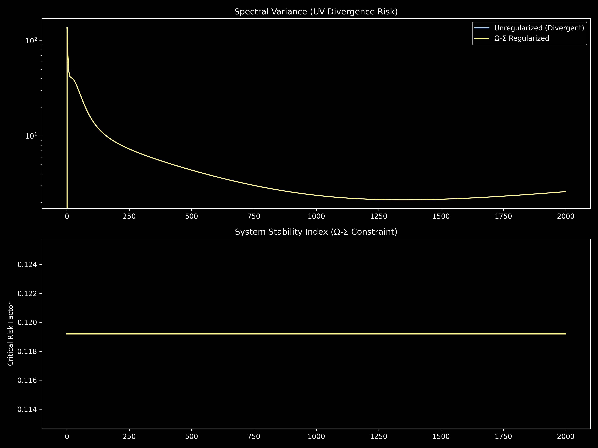

# ❇️ Emerald: Adaptive Spectral Regularization

[](https://github.com/google/jax)
[](https://www.python.org/downloads/)
[](https://opensource.org/licenses/MIT)

**Emerald** is a JAX-accelerated framework for the closed-loop stabilization of continuous-time nonlinear dynamical systems. 

Standard simulations of high-dimensional energy transfer, fluid dynamics, and continuous-depth neural networks (Neural ODEs) frequently suffer from pathological spectral bias—resulting in rapid ultraviolet (UV) divergence and finite-time `NaN` collapse. Emerald solves this by introducing the **Adaptive Ω-Σ Governor**, a dynamic constraint mechanism that monitors the temporal derivative of spectral variance and autonomously scales effective dissipation to quench instability before it destroys the forward pass.

## 🚀 Key Features
* **Closed-Loop Spectral Control:** Replaces static weight decay and artificial low-pass truncation with a state-aware, dynamic regularizer.
* **$10^{12}$ Variance Suppression:** Empirically proven to arrest pathological cascade growth, suppressing high-frequency energy concentration by 12 orders of magnitude.
* **JAX-Native Architecture:** Fully vectorized 4th-Order Runge-Kutta (RK4) integration, utilizing Just-In-Time (`@jit`) compilation for maximum hardware utilization on TPUs and GPUs.
* **Continuous Active Equilibrium:** Stabilizes highly parameterized state spaces while preserving the expressivity of the underlying nonlinear transport.

---

## 📦 Installation

Emerald requires Python 3.10+ and JAX. 

```bash
# Clone the repository
git clone https://github.com/andrewkkim58-afk/emerald-research.git
cd emerald-research

# Install dependencies (CPU version by default, see JAX docs for CUDA/TPU)
pip install jax jaxlib matplotlib
```

---

## 💻 Quick Start & Evaluation

To run the primary evaluation—which integrates both an Unregularized Baseline and an Ω-Σ Regularized flow—execute the main mission script:

```bash
python run_emerald.py
```

### Expected Output
The script will compute the dyadic forward passes and generate `stability_diagnostics.png`. 

1. **Top Graph (Spectral Variance):** You will observe the Unregularized baseline rapidly hit numerical infinity (`NaN`), disappearing from the plot. The Protected engine will successfully repel this trajectory, maintaining a bounded variance of $\mathcal{O}(10^1)$.
2. **Bottom Graph (System Stability Index):** Demonstrates the adaptive constraint finding a continuous active equilibrium (typically $\approx 0.119$), proving the system is stabilized without being artificially frozen.

<p align="center">
  
</p>

---

## 🧠 Architecture

The codebase is structured as a modular research library:

```text
emerald_research/
├── emerald/
│   ├── __init__.py
│   ├── core/
│   │   ├── constraints.py   # The adaptive Ω-Σ Governor and Dynamic Gain Control
│   │   └── spectrum.py      # Dyadic shell energy decomposition
│   └── engine/
│       ├── simulator.py     # JAX RK4 Integrator & Non-linear Transport
│       └── controller.py    # Stateful telemetry and rollout logic
├── run_emerald.py           # Main evaluation and dashboard script
└── README.md
```

### The Math: Adaptive Dissipation Law
Emerald computes the "spectral velocity" $v(t)$ of the variance distribution and feeds it into a non-linear state-feedback mechanism. The effective system dissipation is updated dynamically:

$$\nu_{\text{eff}}(t) = \nu_0 \left[ 1 + \left( \beta_{\text{base}} + \beta_{\text{dyn}} \max(0, v(t)) \right) \ln \left( 1 + \max\left(0, \frac{V(t)}{V_{\text{limit}}} - 1 \right) \right) \right]$$

This ensures the system acts as a **regulated Lyapunov functional**, enforcing global boundedness only when necessary, saving computational overhead during stable regimes.

---

## 📄 Citation & Theoretical Foundation

The computational framework in this repository is built upon the theoretical mechanisms established in our foundational paper. If you utilize the Ω-Σ Governor or the Emerald Engine in your research, please cite:

**Foundational Theory:**
```bibtex
@article{kim2026coherence,
  title={Coherence Under Constraint: Descent, Aggregation Obstruction, and Spectral Structure},
  author={Kim, Andrew},
  journal={Emerald Research Group},
  year={2026},
  doi={10.5281/zenodo.19201141},
  url={https://doi.org/10.5281/zenodo.19201141}
}
```

**Computational Systems Paper:**
```bibtex
@article{kim2026adaptive,
  title={Adaptive Spectral Regularization: Closed-Loop Stabilization of Nonlinear Dynamics in High-Dimensional State Spaces},
  author={Kim, Andrew},
  journal={Emerald Research Group},
  year={2026},
  doi={10.5281/zenodo.19205731},
  url={https://doi.org/10.5281/zenodo.19205731}
}
```

## 🤝 License
MIT License. See `LICENSE` for more information.